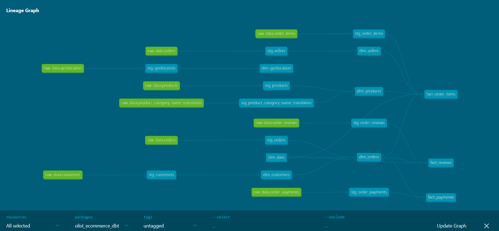

# Olist E-Commerce Analytics Pipeline

End-to-end data pipeline and analytics project using the Brazilian E-Commerce (Olist) dataset — from raw ingestion to a dimensional model built with dbt, queried with SQL, and visualized in Power BI.

**Stack:** Docker · PostgreSQL 15 · Python (pandas, SQLAlchemy) · dbt Core 1.12 · Power BI

---

## Overview

This project simulates a real-world analytics engineering workflow using the [Brazilian E-Commerce Public Dataset by Olist](https://www.kaggle.com/datasets/olistbr/brazilian-ecommerce): 99,441 orders placed between September 2016 and October 2018, covering 96,096 customers, 3,095 sellers, 32,951 products, and roughly 1M geolocation records.

The goal was to build a complete pipeline — from raw data ingestion to business-ready insights — while applying the practices used in production data teams: containerized infrastructure, version-controlled transformations, data quality testing, and a clear separation between raw, staging, and analytics-ready layers.

| | |
|---|---|
| **Models** | 18 (9 staging, 9 marts) |
| **Data quality tests** | 152 — 132 pass, 20 documented warnings, 0 errors |
| **Grain** | order item · payment · review, bridged through `dim_orders` |

---

## Architecture

```
Olist CSVs (Kaggle, downloaded automatically via kagglehub)
        │
        ▼
Docker Compose ── PostgreSQL 15 (healthcheck-gated)
        │
        ▼
pipeline/load.py  ──► schema "raw"        chunked streaming ingestion, idempotent
        │
        ▼
dbt
  models/staging/  ──► type casting, cleaning, 1 model per raw table
  models/marts/    ──► star schema
        │
        ▼
Power BI  ──► dashboard connected to the marts
```

Ingestion runs as its own Docker Compose service that waits on the database healthcheck, so `docker compose up` is enough to go from an empty machine to a populated warehouse.

`load.py` streams each CSV through a `pandas` chunk iterator rather than reading it whole — the geolocation file alone is a million rows — and is idempotent: it replaces the table header on the first chunk, then appends.

---

## Data model

A star schema, with one deliberate design rule: **a number that can be summed, averaged, or counted is a fact; everything else is a dimension.** No fact table joins another fact table — they all route through `dim_orders`, which acts as a bridge dimension. This is what prevents row-duplication fan-out when Power BI resolves relationships across multiple facts.

**Dimensions** — `dim_customers`, `dim_sellers`, `dim_products`, `dim_date`, `dim_geolocation`, `dim_orders` *(bridge)*

**Facts** — `fact_order_items` (grain: order item), `fact_payments` (grain: payment), `fact_reviews` (grain: review × order)

`dim_orders` carries five separate foreign keys into `dim_date` — purchase, approval, carrier handover, customer delivery, and estimated delivery — each a different role for the same dimension.

### Lineage



Generated with `dbt docs generate --static`. Two things are worth reading off it:

- **No fact table connects to another fact table.** All three route through `dim_orders`. That is the bridge dimension doing its job, and it is the property that prevents fan-out in Power BI.
- **`dim_date` has no upstream node**, because it is generated with `dbt_utils.date_spine` rather than read from a source — expected for a date dimension.

`dim_geolocation` is deliberately a leaf: the zip-prefix join to customers and sellers is a relationship in the BI model, not a dbt `ref()`.

---

## Getting started

**Prerequisites:** Docker and Docker Compose, [uv](https://docs.astral.sh/uv/), and a Kaggle account (the dataset downloads automatically).

**1. Configure environment variables**

```bash
cp pipeline/.env.example pipeline/.env
# then edit pipeline/.env and set a real POSTGRES_PASSWORD
```

**2. Start the database and load the raw data**

```bash
docker compose up -d --wait postgres   # Postgres, gated on its healthcheck
docker compose up pipeline             # downloads the CSVs and loads schema "raw"
```

**3. Build the models**

dbt does **not** read `.env` — unlike the ingestion script, which uses `python-dotenv`. The variables must be exported into your shell first, or every `env_var()` resolves empty:

```bash
set -a; source pipeline/.env; set +a

cd dbt_project
uv run dbt deps
uv run dbt build
```

> Run dbt as `uv run dbt`. A bare `dbt` may resolve to dbt Fusion, which does not support the Postgres adapter.

`profiles.yml` lives in `dbt_project/` rather than `~/.dbt/` and reads every credential through `env_var()`, so the repository contains no secrets and a fresh clone is runnable.

---

## Data quality

Tests are split across both layers on purpose, so a failure says *where* it broke: staging asserts what the source and the casting are responsible for, marts asserts what the dimensional model itself creates.

The 20 warnings are documented source-data gaps — each investigated, none silenced with a threshold chosen to make red disappear.

### What the tests actually found

**14 delivered orders with no approval timestamp.** All 14 have payment records totalling R$1,954.60, so the approval event happened and only the timestamp failed to write — a source logging gap affecting 0.015% of 96,478 delivered orders, not a business-process problem. Review scores were considered as evidence and rejected: there is no causal path from "a timestamp failed to write" to "the customer liked the product", so they cannot discriminate between the hypotheses. Payment records can.

**`review_id` is not a primary key.** 789 review ids each cover 2–3 orders — one satisfaction survey sent per customer rather than per order, recorded against every order it refers to. Verified that a repeated id never spans two customers. The real grain is `(review_id, order_id)`, enforced with `dbt_utils.unique_combination_of_columns`. The effect on a global average is negligible (4.0864 vs 4.0888 deduplicated), but it inflates review *counts* by 814 and distorts small-group averages — which matters directly for the delay-vs-satisfaction question.

**Silent placeholder data: 4 products weighing 0 g.** All `bed_bath_table`, identical 30×25 dimensions, and sold 8 times — live rows, not unused ones. A 0 g physical product is impossible, so this is placeholder data rather than a measurement, and `not_null` cannot see it. Fixed with `nullif(product_weight_g, 0)` in staging plus `accepted_range`. Deliberate contrast: 9 payments of R$0.00 (6 voucher, 3 not_defined) were *kept* as valid, because zero is unusual there but not impossible.

**Silent row loss: an inner join dropped 623 products.** `dim_products` originally inner-joined the category translation table, cutting 32,951 products to 32,328 and orphaning 1,627 fact rows without any test failing. Root cause: 610 source nulls plus 13 products in two categories missing from the translation table. Fixed with a left join and a three-argument coalesce falling back to the Portuguese name, then `'unknown category'`. Verified 112,650 / 112,650 fact rows match.

**Join fan-out prevented in `dim_geolocation`.** 19,015 distinct zip prefixes expand to 27,912 distinct (zip, city, state) combinations, because Brazilian city names appear with inconsistent accents and punctuation — zip 13318 alone has five spellings spanning two different towns. Collapsed to exactly one row per zip using `avg()` for coordinates and `mode()` for city and state. `mode()` picks the most frequent spelling; `min()` would have returned a different town entirely.

**A dimension coverage gap caught by a test.** A `shipping_limit_date` of 2020-04-09 fell one day past `dim_date`'s upper bound, producing 2 null date keys — found by a `not_null` test, not by inspection.

### Testing decisions worth explaining

- **`unique` belongs only on grain keys.** Putting it on a fact table's foreign key asserts the opposite of a star schema — that a product could only ever be sold once. Fact grains need composite tests.
- **Scoping separates "missing" from "not applicable."** Each order timestamp becomes mandatory at a different lifecycle stage, so each test carries a different `where` clause: approval is scoped to exclude `created` and `canceled`, carrier handover to `delivered` and `shipped`, customer delivery to `delivered` alone. That takes 160 / 1,783 / 2,965 raw nulls down to 14 / 2 / 8 — the genuine anomalies, with the not-applicable rows removed rather than tolerated.
- **`error_if` thresholds turn known anomalies into regression guards** ("8 is the baseline, alert above 10"), which is a different statement from `severity: warn` ("never block, at any volume").
- **Beware hollow greens.** A `not_null` test on a column that a `coalesce` already backfills always passes and asserts nothing. That test belongs upstream, in staging.
- **Malformed test definitions can fail silently.** A `data_tests:` block written as a YAML mapping instead of a list was discarded with no error and no warning — the tests simply did not exist. `dbt ls --resource-type test --select <model>` is the only reliable confirmation that a test is real.

---

## Business questions

1. How strong is the relationship between delivery delay and review score?
2. Which product categories and regions generate the most revenue, and which have the worst satisfaction?
3. Are there repeat customers, and what differentiates them from one-time buyers? *(2,997 of 96,096 customers ordered more than once — identified via `customer_unique_id`, since `customer_id` is regenerated per order.)*
4. Is payment method related to order value or customer satisfaction?
5. Which sellers perform best combining volume, delivery time, and review scores?

> **Dashboard:** in progress. Screenshots pending.

---

## Project structure

```
├── docker-compose.yml         postgres (healthcheck) + pipeline (depends_on: service_healthy)
├── pipeline/
│   ├── load.py                chunked streaming ingestion → schema "raw"
│   ├── Dockerfile             uv-based image
│   ├── .env.example           template for the 5 Postgres variables
│   └── pyproject.toml         uv-managed
└── dbt_project/
    ├── profiles.yml           credentials via env_var(), no secrets
    ├── models/
    │   ├── staging/           sources.yml + schema.yml + 9 stg_* models
    │   └── marts/             schema.yml + 6 dimensions + 3 facts
    └── packages.yml           dbt_utils
```

There is deliberately no `models/intermediate/` layer — the staging models are thin enough that the marts read directly from them, and adding an empty layer would be cargo-culting.

---

## Notes

The dataset is a static historical export (2016–2018), so dbt models are materialized as views: rebuild cost is trivial and storage stays at zero. A production pipeline with incoming data would materialize the marts as tables.

Author: **César Alejandro España Aragón**
